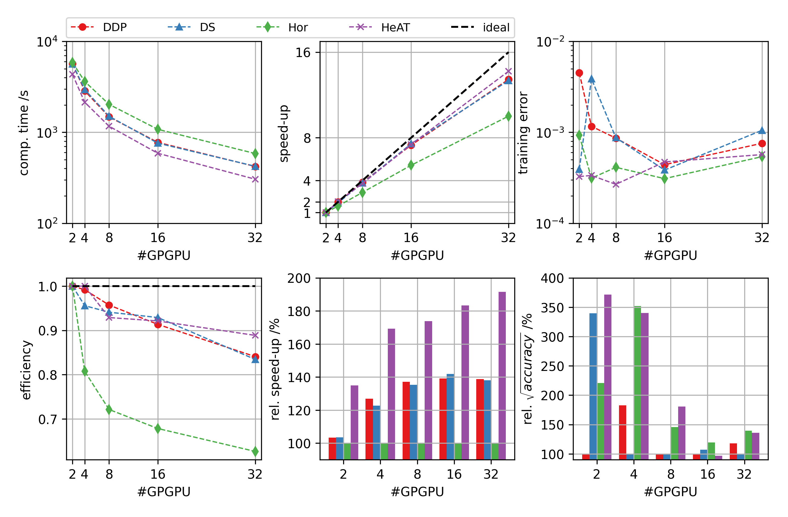
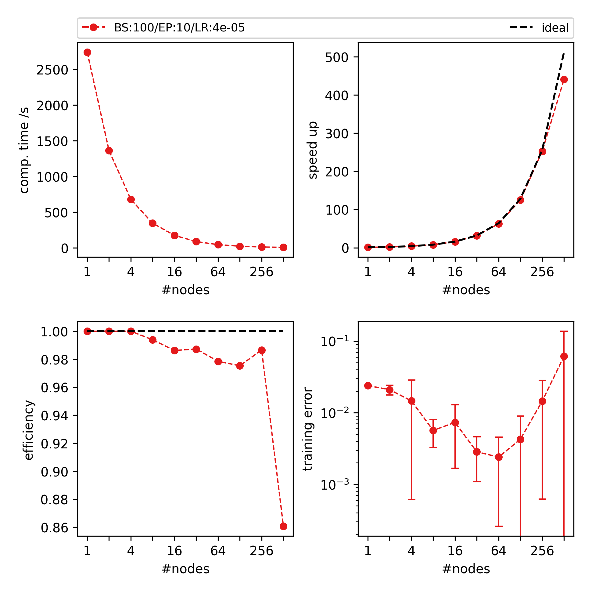
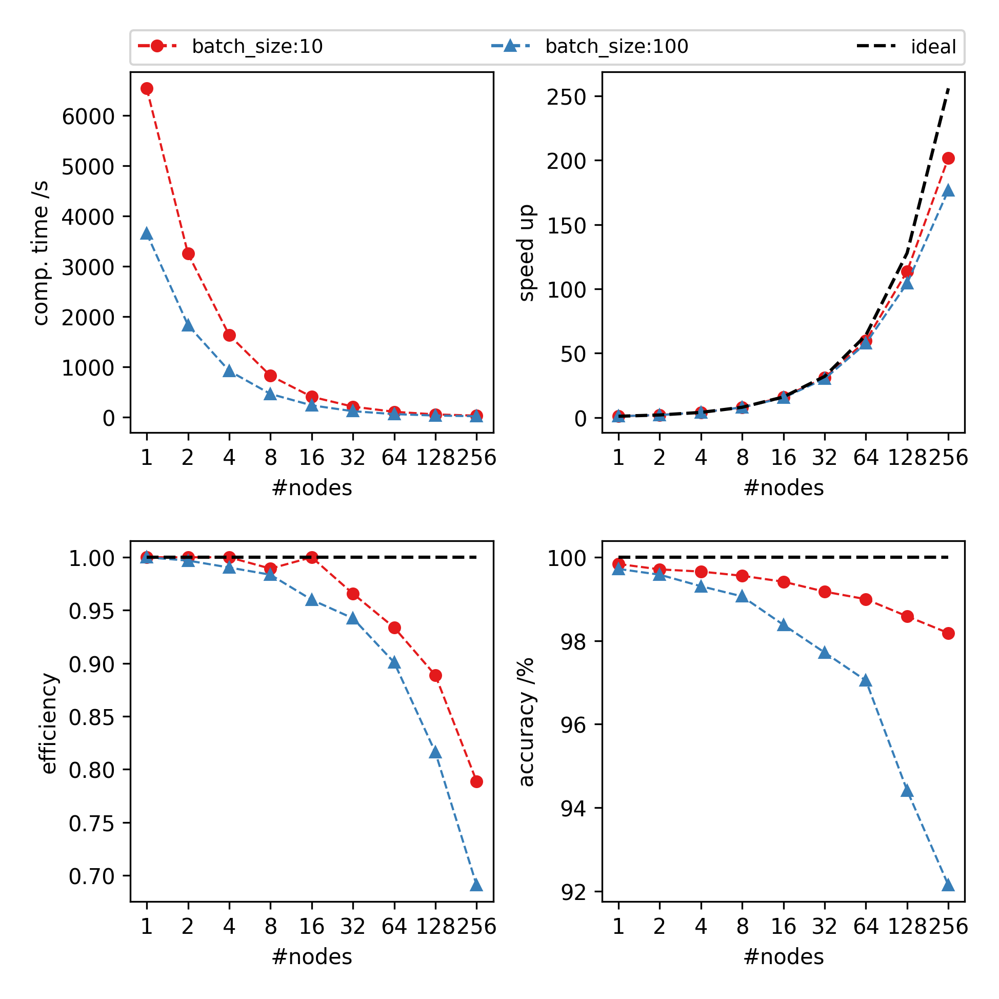
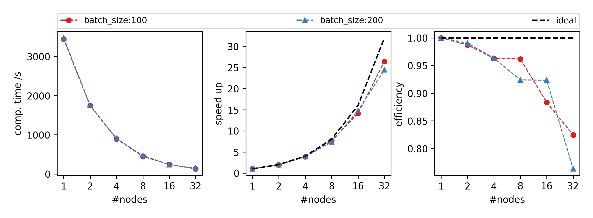
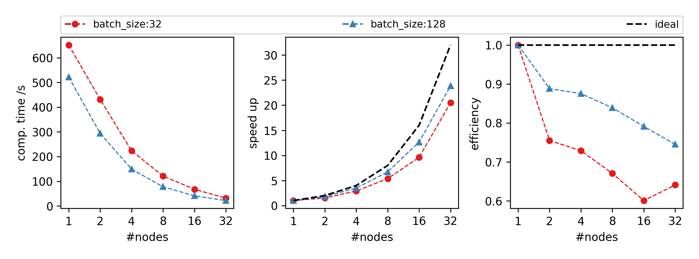
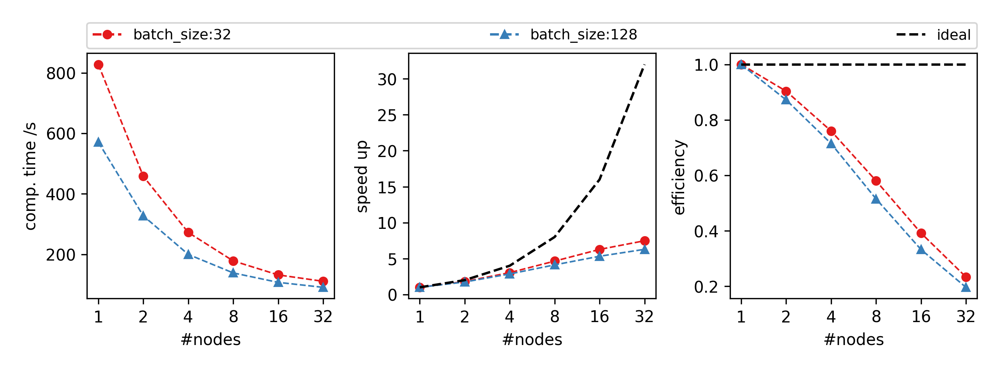

# benchmarks using JUBE
Old results, but still usable.\
Check new results from `Results` folder

## notes
benchmark using Synthetic Data for TBL\
check individual README files in each folder

# old results
1. Framework Comparison w/ NCCL (aka RCCL for AMD) on CTEAMD \
(conf: Dataset=TBL-small, Epoch=10, Learning Rate=0.01, Batch size=96):

2. System Comparison w/ NCCL \
(conf: Dataset=MNISTx100, Epoch=10, Learning Rate=0.01, Batch Size=100):\
(note: AMD: CTEAMD // V100: DEEPEST // A100: JUWELS)

3. DDP/NCCL on JUWELS \
(conf: Dataset=TBL-small, Epoch=10, Learning Rate=0.01, Batch Size=100):

4. DDP/NCCL on JUWELS \
(conf: Dataset=TBL-small, Epoch=10, Learning Rate=scaled, Batch Size=100):

5. DDP/NCCL on JUWELS \
(conf: Dataset=MNISTx100, Epoch=10, Learning Rate=0.01, Batch Size=[10,100]):

6. DDP/MPI on DEEPEST \
(conf: Dataset=MNISTx100, Epoch=10, Learning Rate=0.01, Batch Size=[32,256]):

7. DDP/MPI on DEEPEST \
(conf: Dataset=TBL-small, Epoch=10, Learning Rate=0.01, Batch Size=[100,200]):

8. Horovod/MPI on DEEPEST \
(conf: Dataset=MNISTx100, Epoch=10, Learning Rate=0.01, Batch Size=[32,128]):

9. HeAT/MPI on DEEPEST \
(conf: Dataset=MNIST, Epoch=10, Learning Rate=0.01, Batch Size=[32,128]):

