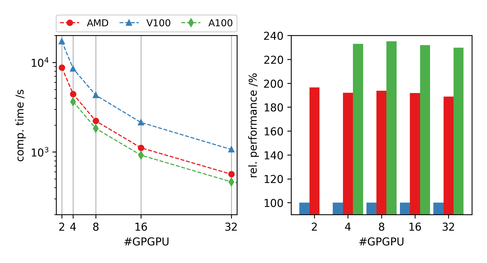
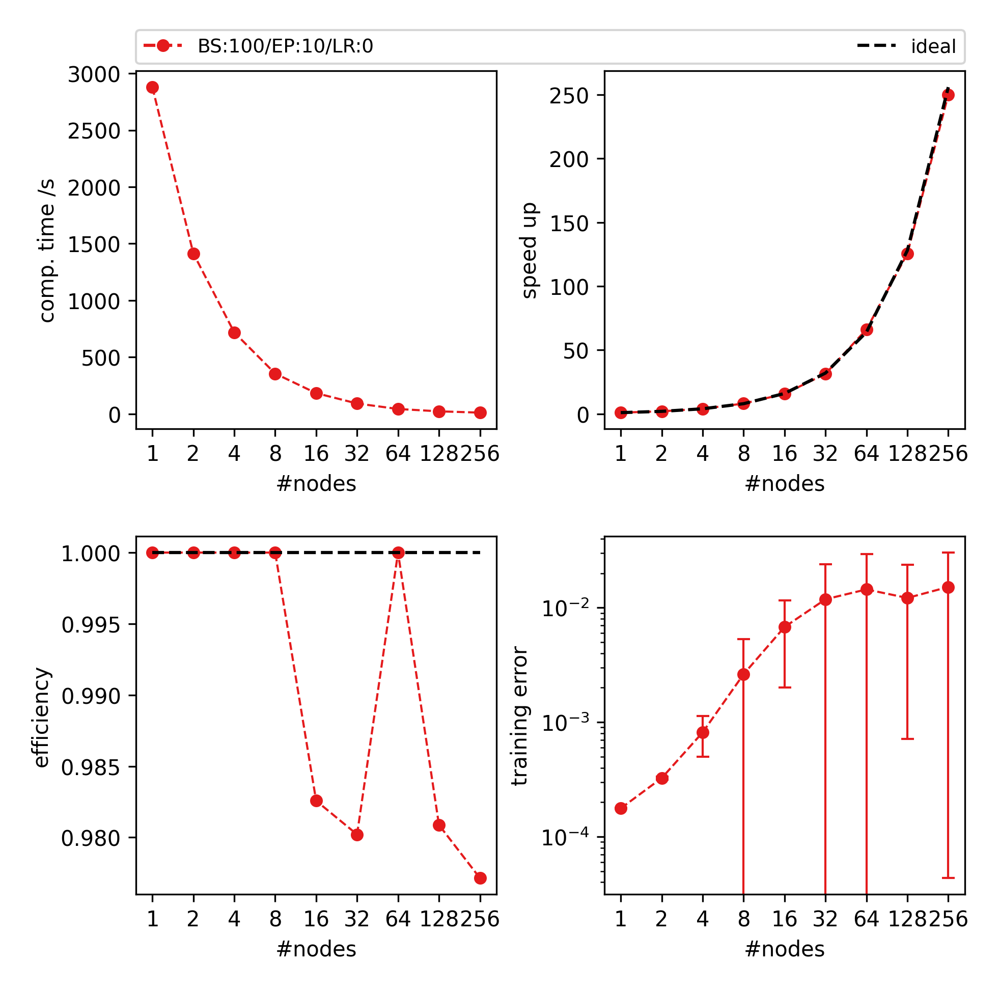
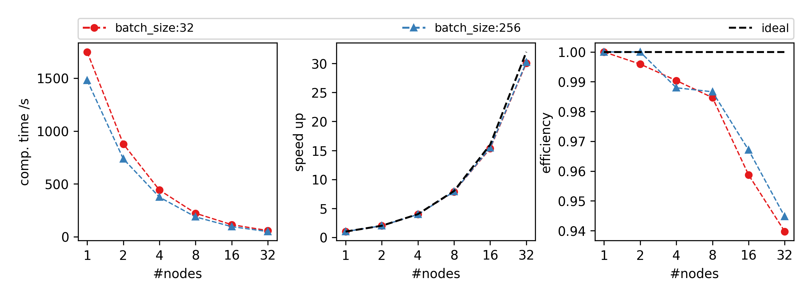

# benchmarks using JUBE

# load JUBE
`ml JUBE`

# setup benchmarks
*modify jobsys.xml if needed*

# run benchmark
`jube run general_jobsys.xml`

# run benchmark on development partitions
`jube run general_jobsys.xml --tag devel`

# check if finalized
`jube continue bench_run --id last`

# print results
1. `jube analyse bench_run --id last`
2. `jube result bench_run --id last`
3. (opt.) `bash results.sh`

# some information
1. `jube info bench_run --id last`
2. `jube log bench_run --id last`

# notes
benchmark using either MNIST and Autoencoder for TBL\
check individual README files in each folder

# results
1. Framework Comparison w/ NCCL (aka RCCL for AMD) on CTEAMD \
(conf: Dataset=TBL-small, Epoch=10, Learning Rate=0.01, Batch size=96):

2. System Comparison w/ NCCL \
(conf: Dataset=MNISTx100, Epoch=10, Learning Rate=0.01, Batch Size=100):\
(note: AMD: CTEAMD // V100: DEEPEST // A100: JUWELS)

3. DDP/NCCL on JUWELS \
(conf: Dataset=TBL-small, Epoch=10, Learning Rate=0.01, Batch Size=100):

4. DDP/NCCL on JUWELS \
(conf: Dataset=TBL-small, Epoch=10, Learning Rate=scaled, Batch Size=100):

5. DDP/NCCL on JUWELS \
(conf: Dataset=MNISTx100, Epoch=10, Learning Rate=0.01, Batch Size=[10,100]):

6. DDP/MPI on DEEPEST \
(conf: Dataset=MNISTx100, Epoch=10, Learning Rate=0.01, Batch Size=[32,256]):

7. DDP/MPI on DEEPEST \
(conf: Dataset=TBL-small, Epoch=10, Learning Rate=0.01, Batch Size=[100,200]):

8. Horovod/MPI on DEEPEST \
(conf: Dataset=MNISTx100, Epoch=10, Learning Rate=0.01, Batch Size=[32,128]):

9. HeAT/MPI on DEEPEST \
(conf: Dataset=MNIST, Epoch=10, Learning Rate=0.01, Batch Size=[32,128]):

# contact:
EI
